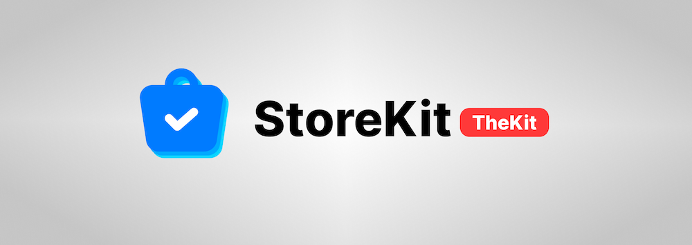

<p align="center">
    
</p>

 


# StoreKitTheKit

A lightweight wrapper for StoreKit2 that makes implementing in-app purchases simple.

## Features

1. **Fast Integration** - Set up StoreKit in minutes, not days
2. **Seamless Offline Support** - Robust local storage ensures purchases work even without internet
3. **Intelligent Connection Management** - Automatically handles transitions between online and offline states of the Store
4. **Comprehensive Support** - Supports all product types: non-consumable IAPs, consumables, auto-renewable subscriptions, and non-renewable subscriptions
5. **Security** - Added Receipt Validation


## Installation

### Swift Package Manager

```swift
dependencies: [
    .package(url: "https://github.com/nicolaischneider/storekitthekit.git", from: "1.0.0")
]
```

### CocoaPods

Add the ollowing line to your `Podfile`:
```ruby
pod 'StoreKitTheKit'
```
Then run `pod install` and open your `.xcworkspace`.

## Setup

### 1. Initialize the store with your items
```swift
await StoreKitTheKit.shared.start(iapItems: [
    Purchasable(bundleId: "com.example.premium", type: .nonConsumable),
    Purchasable(bundleId: "com.example.subscription", type: .autoRenewableSubscription),
    Purchasable(bundleId: "com.example.coins", type: .consumable),
    Purchasable(bundleId: "com.example.season", type: .nonRenewableSubscription)
])
```

### 2. Keep purchases in sync
Call `StoreKitTheKit.shared.syncWithStore()` regularly, e.g,. when app returns to foreground. In SwiftUI, you can automatically sync when the app becomes active:
```swift
.onReceive(NotificationCenter.default.publisher(for: UIApplication.didBecomeActiveNotification)) { _ in
    Task {
        await StoreKitTheKit.shared.syncWithStore()
    }
}
```

## Purchase

### 3. Make purchases
```swift
let result = await StoreKitTheKit.shared.purchaseElement(element: premiumItem)
```

### 4. Check purchase status
```swift
// For non-consumables and subscriptions
let isPremium = StoreKitTheKit.shared.elementWasPurchased(element: premiumItem)

// For consumables (always returns false - handle consumption in your app)
let wasConsumed = StoreKitTheKit.shared.elementWasPurchased(element: consumableItem)
```

### 5. Restore purchases
```swift
await StoreKitTheKit.shared.restorePurchases()
```

## Handle Store Availablility (eg due to missing internet connection)

In SwiftUI
```swift
// Handle the updated store state
.onReceive(StoreKitTheKit.shared.$storeState) { state in
    switch state {
    case .available:
        print("store is accessible")
    case .unavailable:
        print("store is unaccessible")
    case .checking:
        print("connecting to store")
    }
}

// Handling of updated locally stored purchases (eg because of reconnection to internet
.onReceive(StoreKitTheKit.shared.$purchaseDataChangedAfterGettingBackOnline) { changed in
    if changed {
        print("locally stored purchases have been updated.")
    }
}
```

In UIKit:
```swift
// Subscribe at view start to get udpates
func subscribe() {
    // check state for store
    StoreManager.shared.$storeState
        .receive(on: DispatchQueue.main)
        .sink { [weak self] state in
            // Handle the updated store state
        }
        .store(in: &cancellables)
    
    StoreManager.shared.$purchaseDataChanged
        .receive(on: DispatchQueue.main)
        .sink { [weak self] changed in
            guard let self = self else { return }
            if changed {
                // Handling of updated locally stored purchases (eg because of reconnection to internet
            }
        }
        .store(in: &cancellables)
}
```

## Subscription Management

### Check subscription status
```swift
// Basic status check
let isActive = StoreKitTheKit.shared.isSubscriptionActive(for: subscription)

// Detailed status information
let status = StoreKitTheKit.shared.getSubscriptionStatus(for: subscription)
// Returns: active, expired, inGracePeriod, inBillingRetryPeriod, revoked, unknown

// Get remaining time
let timeRemaining = StoreKitTheKit.shared.getSubscriptionTimeRemaining(for: subscription)
```

### Manage subscriptions
```swift
// Open iOS subscription management
StoreKitTheKit.shared.manageSubscription(for: subscription)
```

## Consumable Purchases

Consumables work with the same purchase API but require different handling:

```swift
// Purchase consumable
let result = await StoreKitTheKit.shared.purchaseElement(element: consumableItem)

// Note: elementWasPurchased() always returns false for consumables
// Handle consumption logic in your app after successful purchase
if case .success = result {
    // Add coins to user balance, etc.
}
```

## Price Formatting

```swift
// Get price for an item
let price = StoreKitTheKit.shared.getPriceFormatted(for: item)

// get total price of multiple items
let totalPrice = StoreKitTheKit.shared.getPriceFormatted(for: [item1, item2])

// Compare prices
let (savings, percentage) = StoreKitTheKit.shared.comparePrice(
    for: [item1, item2], with: item3
)
```

## Example

Check out the [example app](Examples/StoreKitTheKitExample) to see a basic implementation.
